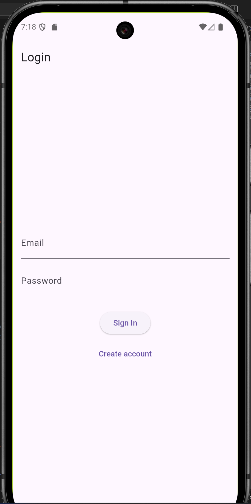
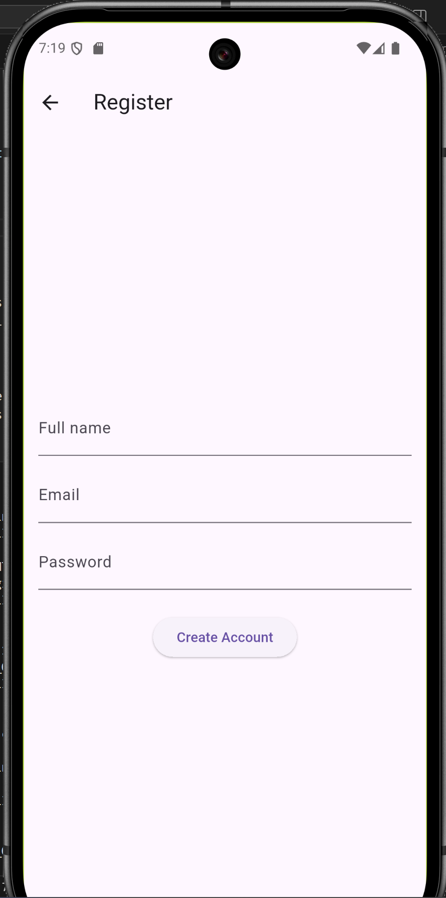
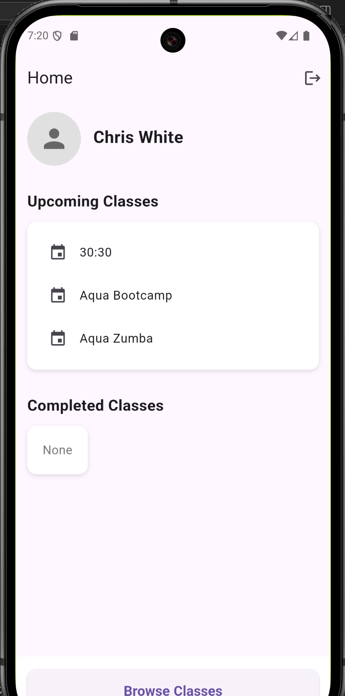
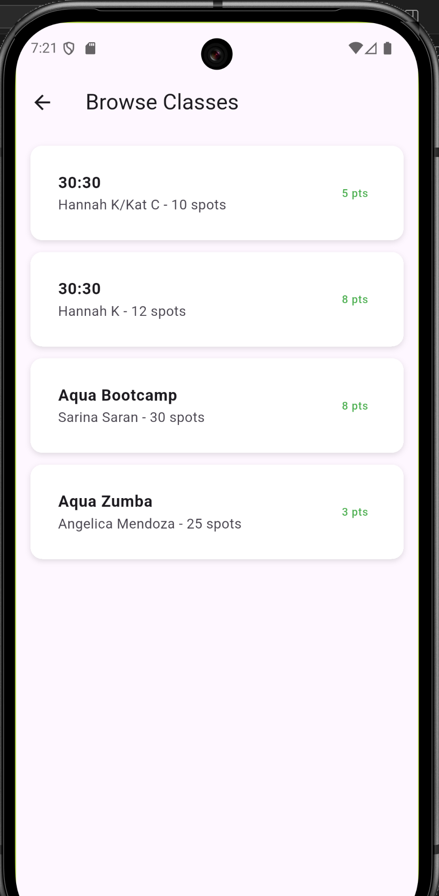
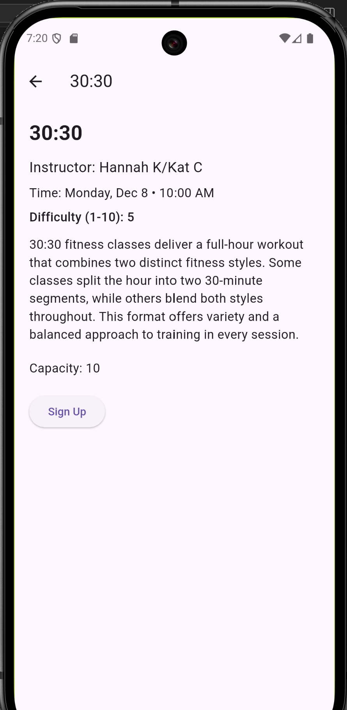

# MPX

## Group
- Chris White
- Ethan Shilling

## Fitness Scheduling Assistant

This app is designed for students to see availble fitness classes, enroll, and manage their schedule of enrolled classes. It provides a login system to allow data to be saved accross devices and the ability to maintain a list of attendees using Firebase

### Login Page
The user is able to log in with a email address and password given that they have already created an account. We use Firebase to store the users' first name, last name, email address, and password. Additionally, Firebase stores their enrolled classes and completed classes which are populated later. This page provides hints if the 'Sign In' button is clicked when not all fields are entered (ex. password must be 6+ characters). The 'Create Account' button brings them to the register page.

### Register Page
This page has a similar layout to the login page and also will provide hints when inputs are not entered correctly. When a new user is created, the user is also created in Firebase. Once users successfully login to their accounts, they are directed automatically to the home page.

### Home Page
The home page displays the currently logged in user, a sign out button in the top right, a browse classes button, and the classes a user is currently enrolled in. If there are no classes, 'None' will be displayed. In the 'Upcoming Classes' container, users can tap to open a window to view more details about the class. If a user long presses on the class it will be removed from the page and they will be unenrolled on Firebase. When 'Browse Classes' is selected it opens a new page with available classes.

### Browse Classes Page
This page displays a list of classes available which are pulled from Firebase. When a user taps one of these, a details page comes up with more info. They can also return to the main page with the back arrow in the top left.

### Class Details Page
This page is used when a class is selected from the browse classes page or the home page. It includes several fields related to the class and a 'Sign Up' button. If a user clicks it, a snackbar will appear telling the user they have successfully enrolled. If they are already enrolled, the snackbar will say this instead.

## Advanced Features
### Screen-Reader Semantics
This app uses semantics to improve TalkBack functionality. On the details page for example, when the difficulty field is selected, the semantics tell TalkBack to read out "Difficulty: {rating} out of 10". It also includes ExcludeSemantics so that it will not read out the default text at is is displayed visually.

### Gestures
This app includes the ability to long press on a class in the upcoming classes container to unenroll. This makes removing a class simple and instantly gives feedback once it is complete in the UI. It also will unenroll the user from the class on Firebase, opening a spot for another user.

## Checklist

- ✅ MVVM diagram with clear boundaries
- ✅ Async operations and isolates
- ✅ Online API or Firebase integration (if applicable)
- ✅ 2 advanced features implemented
- ✅ Accessibility & localization tested (if applicable)
- □ Tests pass locally
- □ README and demo video complete
